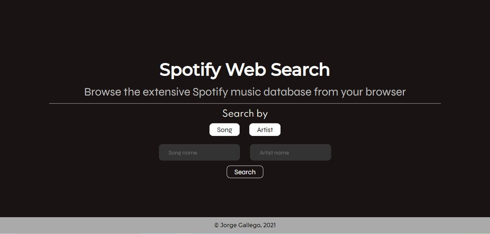

# Spotify-Web-Search

This is a Spotify search project web app.

## Table of Contents

- [Overview](#overview)
    - [The Application](#the-application)
    - [Screenshot](#screenshot)
    - [Links](#links)
- [Development](#development)
    - [Built with](#built-with)
- [Author](#author)

## Overview

### The Application

This application allows the users to search the Spotify music database for artists and songs through the web.
Users can choose which search criteria to use, and can also use them together.
An artist search will return only one result, as well as a artist AND song search.
A song search will return the top five results.

In the case that the intended result doesn't appear, the user can be redirected to Google Search if they want to, through a link at the end if the results page.

### Screenshot

### Links

- [Source Code](https://github.com/Jorge644240/Spotify-Web-Search)
- [Live Application](https://sheltered-scrubland-70708.herokuapp.com/)

## Development

### Built with

This web application was built with the following tools:

- Semantic HTML5 & CSS3
- [Vue.js v3](https://v3.vuejs.org/) - JavaScript Framework
- [Spotify API](https://developer.spotify.com/)
- [Node.js](https://nodejs.org/en/)
- [Express.js](https://expressjs.com/)

The app was also deployed to [Heroku](https://heroku.com).

## Author

- Jorge Gallego - [Personal Website](https://jorge644240.github.io/CV/)